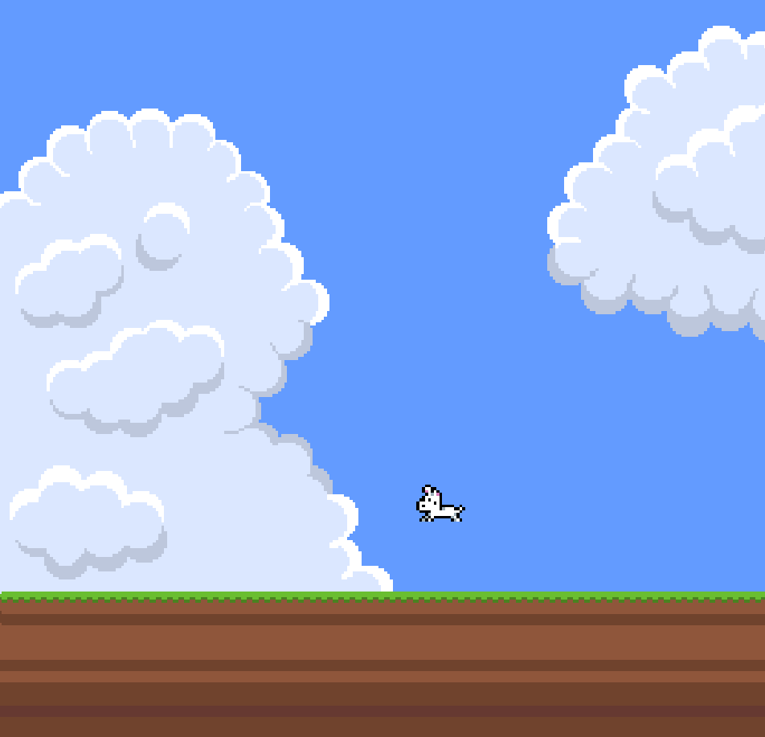
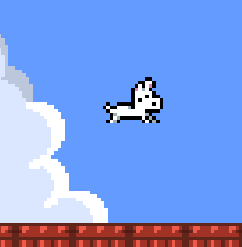
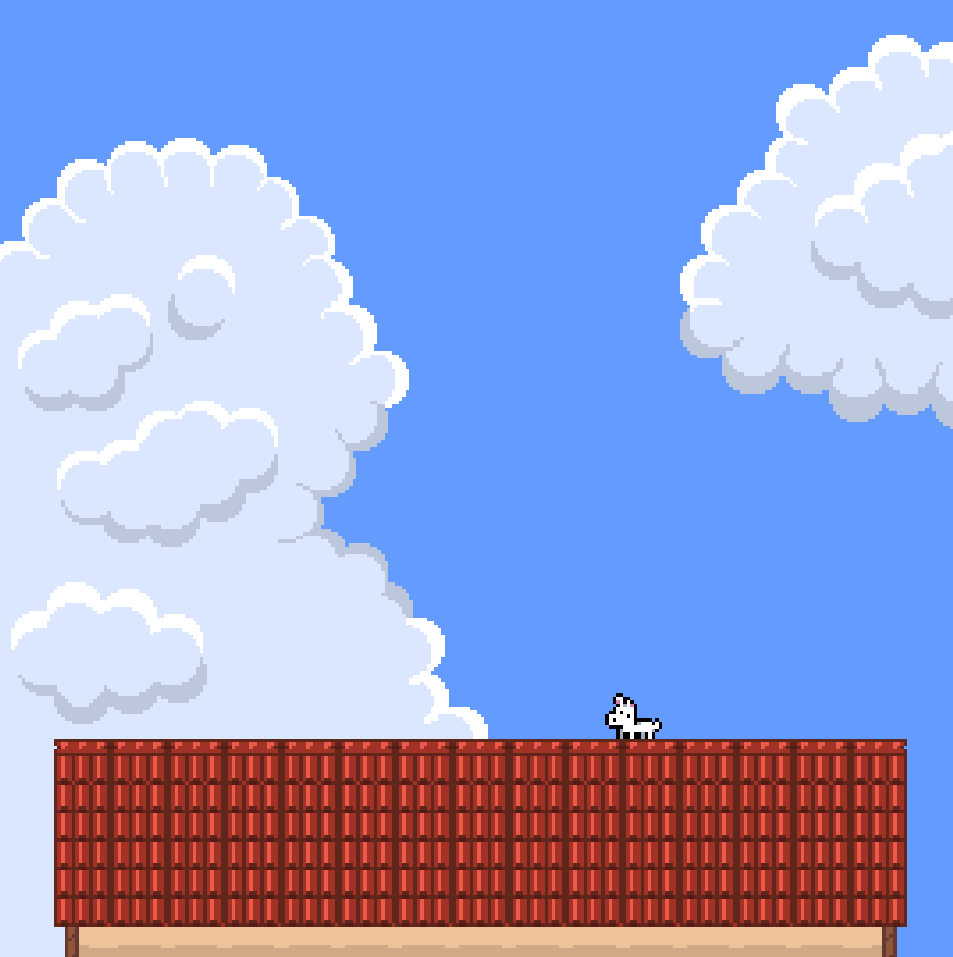
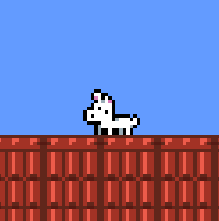

# 🐶 Danko & Luna

> **A storm is coming. Not a normal storm.**

Un perro atrapado sobre el tejado de una casa se enfrenta a una **tormenta de caos**: objetos aleatorios caen desde el cielo sin parar y tendrás que esquivarlos, repelerlos y sobrevivir todo lo que puedas.

Un juego arcade **frenético**, basado en reflejos y reacción rápida, con estética **pixel art 16×16**.

## 🎮 Gameplay

La tormenta no deja de empeorar.

* 🌪️ Esquiva objetos que caen del cielo.
* 💥 Repele los objetos que puedas.
* 🐶 Mantén al perro con vida.
* ⚡ Sobrevive mientras la intensidad aumenta.
* 🎲 Enfréntate a objetos y situaciones impredecibles.
* 🏆 Consigue la mayor puntuación posible.

La idea es sencilla:

**sobrevivir al caos.**

## 🕹️ Características

* Gameplay arcade rápido y frenético.
* Sistema de oleadas/intensidad progresiva.
* Objetos con comportamientos diferentes.
* Mecánica de esquivar y repeler.
* Puntuación basada en supervivencia.
* Pixel art con sprites de **16×16 píxeles**.
* Efectos y feedback visual para reforzar la sensación de caos.

## 🖼️ Capturas

## 🛠️ Tecnologías

* Motor: Godot Engine
* Lenguaje: GDScript
* Arte: LibreSprite (Pixel art 16x16)

## 📈 Estado del proyecto

**En desarrollo 🚧**

### Implementado

* [x] Movimiento del jugador
* [x] Colisiones
* [x] Escenario
* [ ] Objetos Dañinos
* [ ] Mecánica de repeler
* [ ] Reinicio de Partida

Más mecánicas que surgirán sobre la marcha, la creatividad debe ser libre, reducido a objetivos alcanzables.

## 🧠 Desarrollo

El proyecto está planteado como un juego arcade pequeño y centrado en una única idea: **crear una experiencia sencilla de entender pero difícil de dominar**.

Durante el desarrollo estoy trabajando especialmente en centrarme en rejugabilidad con estilo roguelike o roguelite. Ya que es un género que obliga a entener el GameLoop, saber balancear las mejoras, los enemigos etc ya que NO es lineal.

Dominar un sistema incremental "infinito" hasta niveles que ni si quiera sé

## ❤️ Personal

Este proyecto es mi hobbie, mi sueño desde pequeño ha sido desarrollar videojuegos, con este proyecto no busco sacar el próximo Hollow Knight, ni el GTA 7.

Busco terminar un juego, aunque sea simple pero que esté bien acabado. Busco superarme cada día y seguir aprendiendo para poder enseñarle al mundo de que yo también soy capaz de crear algo. Desarrollar Videojuegos o Programas me parece una forma maravillosa de transmitir lo que somos, es una forma de expresión distinta al arte o la música ya que reproduces interacción con otras personas. Quiero que la gente se lo pase bien con mi juego. Gracias <3
